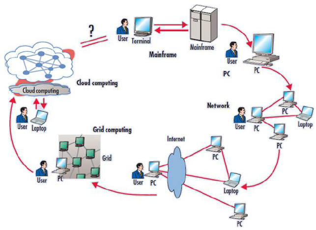
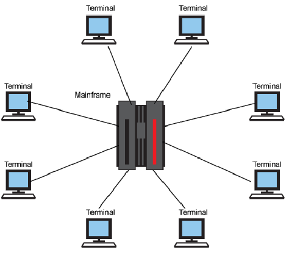
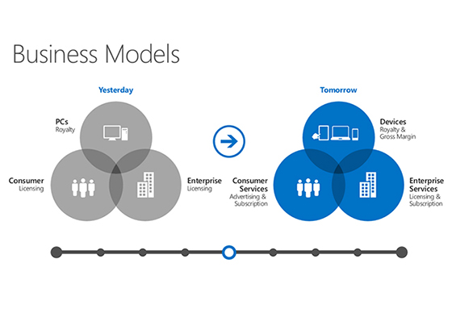
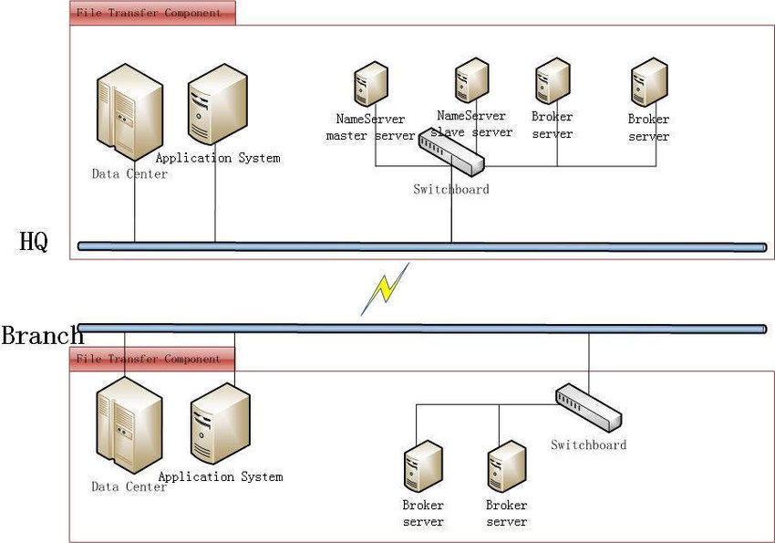
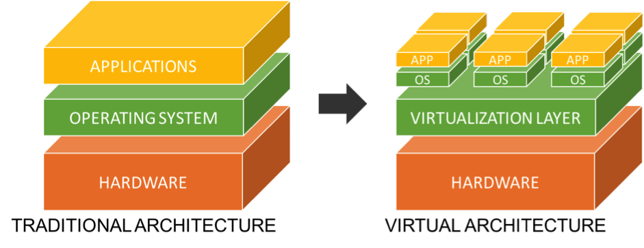
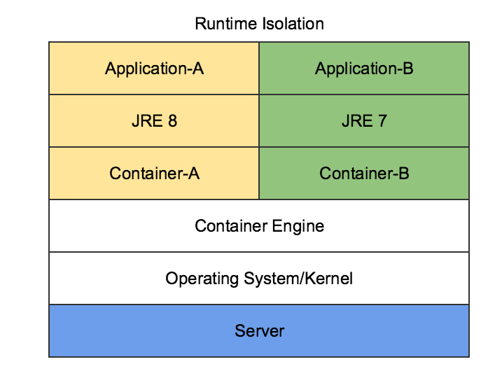
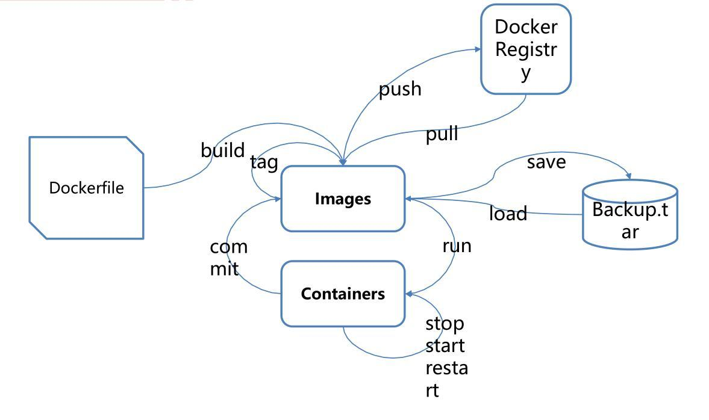
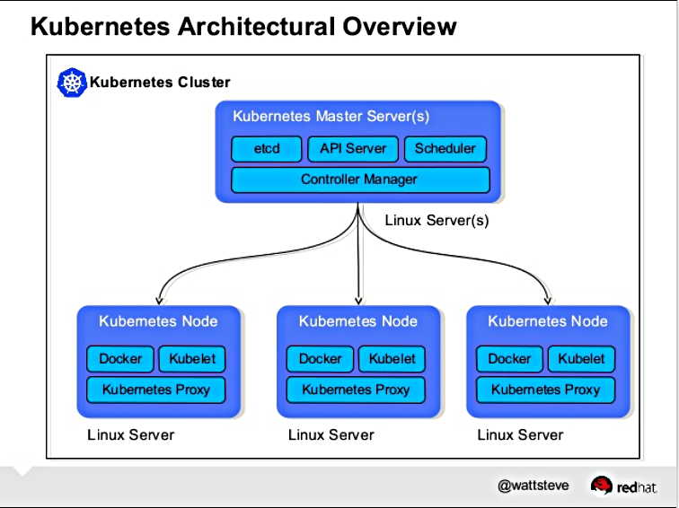

# Docker and Kubernetes from Scratch

# Brief History of Computing


## Mainframes
### Centralized Computation


## Windows
### Birth of a Buisiness Model


### Decentralized Chaos



## Virtualization
### Isolated Units of Computation



## Containerization
### Miniature Shippable Environments



# Docker

## Poll
1. Expert with docker
2. I can do some complex things with docker
3. I've used docker before
4. I've heard of docker
5. What is a docker?

https://www.docker.com/play-with-docker

## Container Lifecycle


## Common Commands

Working with the Docker Engine
```
# Display Help Menu for Docker
docker --help

# Everything you didn't want to know about your docker engine
docker info
```

Working with Docker Images
```
# Enumerate downloaded images
docker images

# Search the current docker repository for images
docker search redis

# Download an image from the repository to your docker engine
docker pull redis
```

https://hub.docker.com/

Working with Docker Containers
```
# Run an application inside of docker
docker run hello-world

# Drop into a terminal live
docker run -it ubuntu bash

# Run a process as a backgrounded daemon process
docker run --rm -d -p 6379:6379 redis

# Communicate with running containers over exposed ports
echo "INFO" | nc localhost 6379
```

Persistent and Resilient Containers
```
# Command your docker container to restart when it crashes, unless manually stopped
docker run -d --restart unless-stopped -p 6379:6379 redis

# Send shutdown command to kill your redis server
echo "SHUTDOWN" | nc localhost 6379
```

Sharing Files with Containers
```
# Mounting a local file or folder into a container
docker run --rm -it -v $(pwd):/opt/app debian bash
```

## Dockerfile
> Dockerfile
```
FROM debian
COPY secrets .
RUN echo "MOAR" > secrets
```

Build Image from Dockerfile
```
# Compile the Dockerfile into a Docker Image
docker build .
```

## OCI Images

https://github.com/opencontainers/image-spec/blob/master/spec.md

* Note to self: untar previous image

## Distroless

https://github.com/GoogleContainerTools/distroless

## Multi-stage Builds

> main.go
```
package main

import "fmt"

func main() {
    fmt.Println("Hello world!")
}
```

> Dockerfile
```
FROM golang:alpine
WORKDIR /app
ADD . /app
RUN cd /app && go build -o goapp
ENTRYPOINT ./goapp
```

> Dockerfile
```
# build stage
FROM golang:alpine AS build-env
ADD . /src
RUN cd /src && go build -o goapp

# final stage
FROM alpine
WORKDIR /app
COPY --from=build-env /src/goapp /app/
ENTRYPOINT ./goapp
```

> Dockerfile
```
# build stage
FROM golang:alpine AS build-env
ADD . /src
RUN cd /src && go build -o goapp

# final stage
FROM gcr.io/distroless/base-debian10
WORKDIR /app
COPY --from=build-env /src/goapp /app/
ENTRYPOINT ./goapp
```

## Compose

https://docs.docker.com/compose/django/

Exploring Compose
```
docker-compose --help
```

> Dockerfile
```
FROM python:3
ENV PYTHONUNBUFFERED 1
RUN mkdir /code
WORKDIR /code
COPY requirements.txt /code/
RUN pip install -r requirements.txt
COPY . /code/
```

> requirements.txt
```
Django>=2.0,<3.0
psycopg2-binary>=2.8
```

> docker-compose.yaml
```
version: '3'
    
services:
    db:
        image: postgres
        environment:
            - POSTGRES_DB=postgres
            - POSTGRES_USER=postgres
            - POSTGRES_PASSWORD=postgres
    web:
        build: .
        command: python manage.py runserver 0.0.0.0:8000
        volumes:
            - .:/code
        ports:
            - "8000:8000"
        depends_on:
            - db
```

Build an example app!
```
# Start the Django application cluster
docker-compose up -d --build

# Check the status of your application
docker-compose ps

# Run a command in a specific container
docker-compose run web django-admin startproject composeexample .
```

Debug and Troubleshoot your Application
```
# Follow (tail) the logs for the whole compose stack
docker-compose logs -f

# Follow the logs for a specific container in the stack
docker-compose logs -f web

# What are my containers even doing?
docker-compose top


```

## Alternatives

# Kubernetes

https://kubectl.docs.kubernetes.io/
https://kubernetes.io/docs/reference/kubectl/cheatsheet/
https://kubernetes.io/docs/reference/generated/kubernetes-api/v1.18/
https://kubernetes.io/docs/reference/generated/kubectl/kubectl-commands
https://www.katacoda.com/courses/kubernetes/kubectl-run-containers#

## Control Theory


## Apiserver, Controller-Manager, Proxy, and Scheduler



## Kubeadm, Kubelet, Kubectl, and Kustomize

```
# Configure your kubectl
kubectl config

# Show information about the currently connected cluster
kubectl cluster-info

# Show all available api resources in the cluster
kubectl api-resources

# Dump a backup of the current cluster configuration into folder
kubectl cluster-info dump --output-directory=./backup
```

# Kubernetes Resources - Compute

## Nodes

```
# Display information about the system (or VM) your k8s cluster is running on
kubectl get nodes

# Mark a node a unable to deploy more workloads onto
kubectl cordon

# Gracefully remove all workloads from node
kubectl drain
```

## Namespaces

```
# Show the API Specification of what a namespace is
kubectl explain namespaces

# Show a list of all namespaces in the current cluster
kubectl get namespaces

# Create a namespace from commandline
kubectl create namespace kube-class

# Create a namespace from a minimal YAML template
cat <<EOF | kubectl apply -f -
apiVersion: v1
kind: Namespace
metadata:
  name: kube-class
EOF
```

## Pods

```
# Show the API Specification of what a pod is
kubectl explain pods

# Show a list of all pods in the current namespace
kubectl get pods

# Create a Pod from a minimal YAML template
cat <<EOF | kubectl apply -f -
apiVersion: v1
kind: Pod
metadata:
  name: kubernetes-bootcamp
spec:
  containers:
  - name: kubernetes-bootcap
    image: gcr.io/google-samples/kubernetes-bootcamp:v1
EOF

# Forward port 8080 from your new deployment to 8080 locally
kubectl port-forward kubernetes-bootcamp 8080:8080

# Curl the port that was just forwarded
curl http://localhost:8080
```

## Deployments

```
# Show the API Specification of what a pod is
kubectl explain deployments

# Get a list of all deployments in the current namespace
kubectl get deployments

# Create a deployment from the command line
kubectl create deployment kubernetes-bootcamp --image=gcr.io/google-samples/kubernetes-bootcamp:v1

# Port Forward
kubectl port-forward deployment.apps/kubernetes-bootcamp 8080:8080

# Dump the configuration for a deployment
kubectl get deployments.apps kubernetes-bootcamp -oyaml

# Create a deployment from a minimal yaml
cat <<-EOF | kubectl apply -f -
apiVersion: apps/v1
kind: Deployment
metadata:
  name: kubernetes-bootcamp
spec:
  selector:
    matchLabels:
      app: kubernetes-bootcamp
  template:
    metadata:
      labels:
        app: kubernetes-bootcamp
    spec:
      containers:
      - name: kubernetes-bootcamp
        image: gcr.io/google-samples/kubernetes-bootcamp:v1
EOF

# Scale the replicas for a deployment
kubectl scale deployment.apps/kubernetes-bootcamp --replicas 3
```

## Replicata Sets

```
# Show the API Specification of what a replica is
kubectl explain replicasets.apps

# Get a list of all replica sets in the current namespace
kubectl get replicasets.apps
```

## Statefulset

```
# Show the API Specification of what a stateful set is
kubectl explain statefulsets.apps

# Get a list of all stateful sets in the current namespace
kubectl get statefulsets.apps
```

## Job

```
# Show the API Specification of what a batch job is
kubectl explain jobs.batch

# Get a list of all batch jobs in the current namespace
kubectl get jobs.batch
```

# Kubernetes Resources - Networking
## Service

```
# Show the API Specification of what a service is
kubectl explain service

# Get a list of all services in the current namespace
kubectl get service

# Create a service and use it to expose port 8080 on our deployment
kubectl expose deployment kubernetes-bootcamp --port 8080

# Port forward a service
kubectl port-forward service/kubernetes-bootcamp  8080:8080

# Patch a service to convert it to NodePort
kubectl patch service kubernetes-bootcamp -p '{"spec": {"type": "NodePort"}}'

# Grab information from cluster and curl external IP
HOST=$(kubectl get node minikube -ojsonpath='{.status.addresses[0].address}')
PORT=$(kubectl get service kubernetes-bootcamp -ojsonpath='{.spec.ports[0].nodePort}')
curl "http://${HOST}:${PORT}"

# Create service from yaml
cat <<-EOF | kubectl apply -f -
apiVersion: v1
kind: Service
metadata:
  name: kubernetes-bootcamp
spec:
  ports:
  - port: 8080
    protocol: TCP
    targetPort: 8080
  selector:
    app: kubernetes-bootcamp
EOF
```

## Ingress

```
# Show the API Specification of what an ingress is
kubectl explain ingree

# Get a list of all ingress in the current namespace
kubectl get ingress
```

# Kubernetes Resources - Storage
## Volume

```
# Show the API Specification of what a persistent volume is
kubectl explain persistentvolumes

# Get a list of all persistent volumes in the current cluster
kubectl get persistentvolumes
```

## Persistent Volume Claim

```
# Show the API Specification of what a persistent volume claim is
kubectl explain persistentvolumeclaims

# Get a list of all persistent volume claims in the current namespace
kubectl get persistentvolumeclaims
```

# Kubernetes Resources - Configuration
## ConfigMap

```
# Show the API Specification of what a configmap is
kubectl explain configmaps

# Get a list of all configmaps in the current namespace
kubectl get configmaps
```

## Secret

```
# Show the API Specification of what a secret is
kubectl explain secrets

# Get a list of all secrets in the current namespace
kubectl get secrets
```

# Kubernetes Native Application Development

```
cat <<-EOF | kubectl apply -f -
---
apiVersion: apps/v1
kind: Deployment
metadata:
  name: kubernetes-bootcamp
spec:
  selector:
    matchLabels:
      app: kubernetes-bootcamp
  template:
    metadata:
      labels:
        app: kubernetes-bootcamp
    spec:
      containers:
      - name: kubernetes-bootcamp
        image: gcr.io/google-samples/kubernetes-bootcamp:v1
---
apiVersion: v1
kind: Service
metadata:
  name: kubernetes-bootcamp
spec:
  ports:
  - port: 8080
    protocol: TCP
    targetPort: 8080
  selector:
    app: kubernetes-bootcamp
---
apiVersion: networking.k8s.io/v1beta1
kind: Ingress
metadata:
  name: ingress-kubernetes-bootcamp
spec:
  rules:
  - host: kubernetes-bootcamp.local
    http:
      paths:
      - path: /
        backend:
          serviceName: kubernetes-bootcamp
          servicePort: 8080
EOF

curl -H"Host: kubernetes-bootcamp.local" "http://${HOST}/"

for i in {1..100}; do curl -H"Host: kubernetes-bootcamp.local" "http://${HOST}/" ; sleep 1; done

kubectl set image deployments/kubernetes-bootcamp kubernetes-bootcamp=jocatalin/kubernetes-bootcamp:v2

kubectl rollout status deployment kubernetes-bootcamp

kubectl set image deployments/kubernetes-bootcamp kubernetes-bootcamp=jocatalin/kubernetes-bootcamp:vo

kubectl rollout pause deployment kubernetes-bootcamp

kubectl rollout resume deployment kubernetes-bootcamp

kubectl rollout undo deployment kubernetes-bootcamp
```
